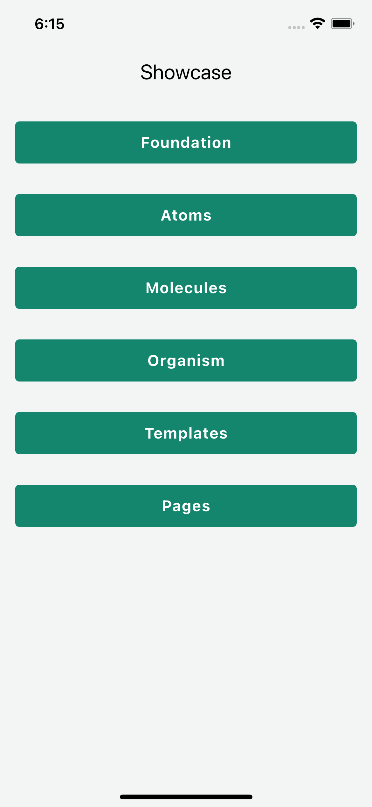
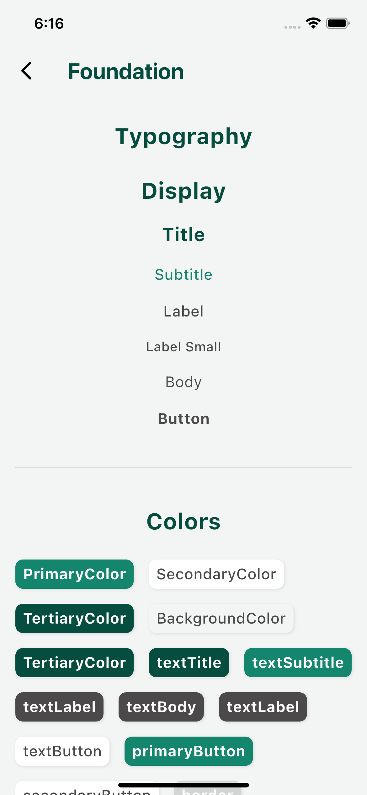
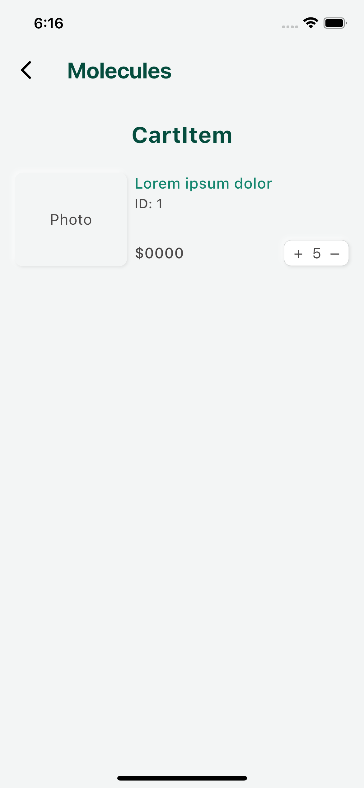
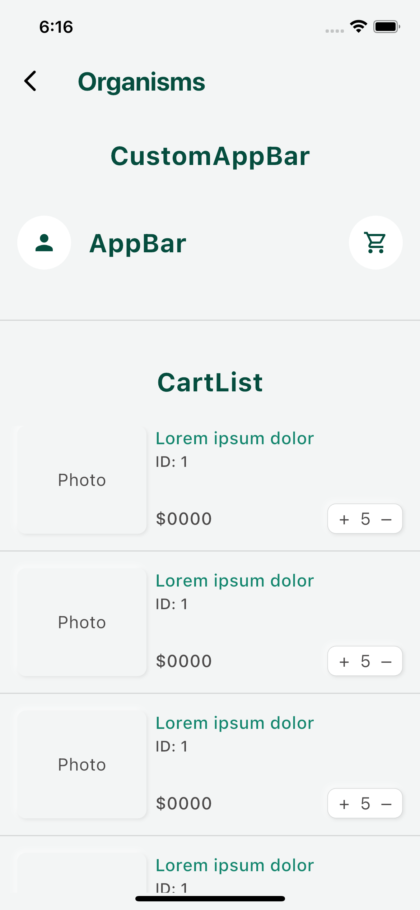
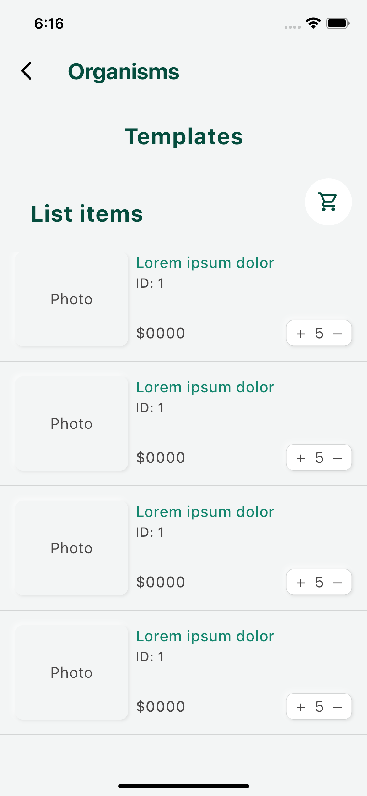
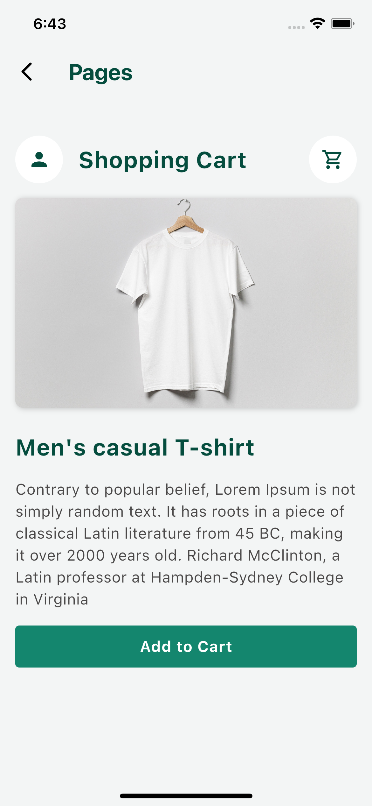

# 📦 ecommerce_system_design

Sistema de diseño para aplicaciones de comercio electrónico en Flutter, inspirado en los principios de **Atomic Design**. El objetivo es ofrecer una base sólida, escalable y consistente para construir UI reutilizables de forma modular.

---

## 🧠 Filosofía del Proyecto

Este sistema está construido bajo los principios de [Atomic Design](https://bradfrost.com/blog/post/atomic-web-design/), que divide los componentes de UI en cinco niveles:

- **Átomos**: Elementos fundamentales (botones, íconos, tipografías).
- **Moléculas**: Combinaciones simples de átomos (campos de formulario, encabezados).
- **Organismos**: Componentes complejos y reutilizables (tarjetas de producto, listas).
- **Templates**: Estructura general de una página, sin contenido real.
- **Pages**: Páginas con contenido real que usan templates y organismos.

---

## 📁 Estructura del Proyecto

```plaintext
lib/
├── atoms/         # Elementos UI básicos (e.g., botones, íconos, textos)
├── molecules/     # Combinaciones simples de átomos
├── organisms/     # Componentes grandes y reutilizables
├── templates/     # Layouts de pantallas sin contenido específico
├── pages/         # Páginas completas con contenido real
├── tokens/        # Recursos básicos como shadows, colors, font_sizes.
├── foundation/    # Estilos generales creados utilizando los tokens
├── showcase/      # App de ejemplo del uso del paquete
```

---

## 🖼️ Pantallas

### Home Page:



Pantalla principal que muestra una lista de botones para acceder a las diferentes secciones del sistema de diseño.

### Atoms Page:



Vista de los componentes más básicos (átomos), como botones, textos e íconos personalizados.

### Molecules Page:



Pantalla que muestra combinaciones simples de átomos, como tarjetas pequeñas.

### Organisms Page:



Sección que presenta componentes más complejos compuestos por múltiples moléculas, como secciones completas de UI.

### Templates Page:



Diseños base que estructuran pantallas sin contenido específico, listos para ser reutilizados.

### Pages Page:



Ejemplos de pantallas completas usando templates, organismos y contenido real, como páginas de producto o checkout.

---

## Instalación

Para utilizar este paquete, añade `ecommerce_system_design` a las dependencias de tu proyecto en el archivo `pubspec.yaml`:

```yaml
dependencies:
  flutter:
    sdk: flutter
  ecommerce_system_design:
    git:
      url: https://github.com/Carl0395/ecommerce_system_design.git
```

## ▶️ Ejecutar la demo (showcase)

### Pasos para ejecutarla:
1. Clona el repositorio:

```bash
  git clone https://github.com/Carl0395/ecommerce_system_design.git
  cd ecommerce_system_design
```

2. Ejecuta la demo desde la raíz del proyecto:

```bash
cd showcase
flutter run
```


## 🧪 API

### Atoms

| Class Name         | Description                                                                                         | Usage Example |
| ------------------ | --------------------------------------------------------------------------------------------------- | ------------- |
| `CardBox`          | Contenedor estilizado que encapsula contenido dentro de una tarjeta con bordes y sombra.            | `CardBox(child: ...)` |
| `CircleButton`     | Botón circular que puede contiene un icono, comúnmente utilizado para acciones rápidas.             | `CircleButton(onTap: ..., child: Icon(...))` |
| `Counter`          | Componente que muestra y permite modificar un valor numérico, como la cantidad de un producto.      | `Counter(value: ..., onIncrement: ..., onDecrement: ...)` |
| `CustomDivider`    | Separador horizontal o vertical personalizado para dividir secciones de contenido.                  | `CustomDivider()` |
| `CustomTag`        | Etiqueta estilizada utilizada para mostrar categorías, estados o etiquetas descriptivas.            | `CustomTag(label: 'Nuevo')` |
| `CustomTextButton` | Botón de texto personalizado que permite estilos y comportamientos específicos.                     | `CustomTextButton(onTap: ..., text: 'Ver más')` |
| `CustomTitle`      | Componente de texto estilizado para títulos o encabezados de secciones.                             | `CustomTitle(text: 'Ofertas')` |
| `DescriptionText`  | Componente de texto diseñado para mostrar descripciones o detalles adicionales.                     | `DescriptionText(text: 'Este producto es...')` |
| `HeaderBox`        | Contenedor para encabezados que puede incluir títulos, subtítulos o acciones relacionadas.          | `HeaderBox(child: ...)` |


### Molecules

| Class Name       | Description                                                                                                 | Usage Example |
| ---------------- | ----------------------------------------------------------------------------------------------------------- | ------------- |
| `CartItem`       | Componente que representa un producto en el carrito de compras, mostrando detalles como imagen, nombre, precio y cantidad. | `CartItem()` |
| `HeaderImageBox` | Contenedor que muestra una imagen destacada en la parte superior de la pantalla, utilizado para banners promocionales o encabezados visuales. | `HeaderImageBox(url: '...')` |

### Organisms

| Class Name       | Description                                                                                                 | Usage Example |
| ---------------- | ----------------------------------------------------------------------------------------------------------- | ------------- |
| `CartList`       | Componente que muestra una lista de productos en el carrito de compras, permitiendo visualizar y gestionar múltiples `CartItem`. | `CartList()` |
| `CustomAppBar`   | Barra de navegación personalizada que permite incluir títulos, íconos y acciones específicas según las necesidades de la aplicación. | `CustomAppBar(title: 'Tienda')` |

### Templates

| Class Name     | Description                                                                                                 | Usage Example |
| -------------- | ----------------------------------------------------------------------------------------------------------- | ------------- |
| `ListTemplate` | Plantilla reutilizable que organiza y muestra una lista de elementos, como productos o categorías, con un diseño consistente y estilizado. | `ListTemplate()` |

### Pages

| Class Name     | Description                                                                                                 | Usage Example |
| -------------- | ----------------------------------------------------------------------------------------------------------- | ------------- |
| `ShoppingCart` | Componente que representa un producto, mostrando una descripción y foto del producto permitiendo al usuario revisar su selección antes de proceder al pago. | `ShoppingCart(items: [...])` |


## 🧪 Ejemplo rápido de uso

Este es un ejemplo básico utilizando el componente `AtomText` del paquete:

```dart
  @override
  Widget build(BuildContext context) {
    return Scaffold(
      appBar: AppBar(title: const Text('Demo')),
      body: const Center(
        child: CustomTextButton(text: '¡Hola desde AtomText!', onTap: () {}),
      ),
    );
  }
```

🔍 Para explorar una implementación completa del sistema de diseño, visita la carpeta [showcase].
